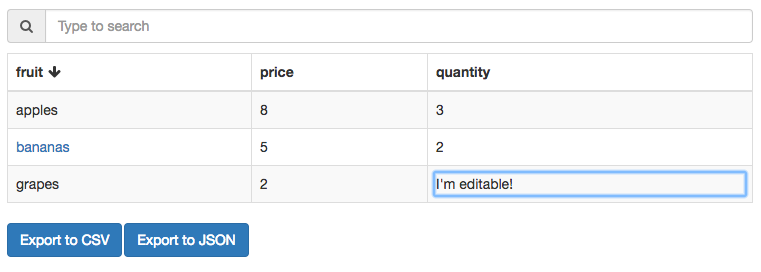

# reactable-search
Searchable table with simple JSON row definitions

[](https://circleci.com/gh/dbjohnson/reactable-search)
[](https://codeclimate.com/github/dbjohnson/reactable-search)
[](https://www.npmjs.com/package/reactable-search)
[]()


[](https://dbjohnson.github.io/reactable-search/demo)

[live demo](https://dbjohnson.github.io/reactable-search/demo)


## Description
This React component is a simple live-searchable table with some basic enhancements:

* Regex search
* Optionally editable cells with callback
* Optional separate values for display vs. sort
* Export to CSV and JSON
* Expandable rows

## Quickstart

###Install via npm
```bash
$ npm install --save reactable-search
```

## Usage

### Basic example

``` js
import SearchTable from 'reactable-search';
import ReactDOM from 'react-dom';

var rows = [
  {a: 1, b: 2},
  {a: 2, b: 3},
  ...
];

ReactDOM.render(
  <SearchTable
    searchPrompt="Type to search"
    rows={rows}/>,
  document.getElementByID("root");
```


###Row details
Each row can be either a simple JSON object where `key:value` specifies `colname:display`, or contain separate keys for `cells` and `children` for rows that are dynamically expandable.  The value under the `cells` key should be a simple row definition; the value under the `children` key should be a list of child rows.  Note that child rows do not have to share the same columns as parent rows, allowing arbitary DOM to be appended to each row -[see demo](https://dbjohnson.github.io/reactable/demo).

####Simple row example

```js
var rows = [
  {a: 1, b: 2},
  {a: 2, b: 3},
  ...
];
```

####Exapandable row example

```js
var expandableRows = [
  {
    cells: {a: 1, b: 2}
    children: [{
      cells: {c: 'x'},
      children: [...]
    }, 
  }, 
  ...
];
```

### Cell details

Similar to rows, cell definition may be any valid DOM, or a contain a "rich" definition allowing optional specification of separate values for sorting vs. display, and an `onChange` callback function, which if provided will make the cell editable.

#### Rich cell example
```js
var rows = [
  {
    cells: {
      fruit: {
        display: <label className="label label-danger">bananas</label>,
        sortVal: 5,
        onChange: (e) => { console.log('You can watch my changes:', e) }
      },
      price: 5, 
      quantity: 2
  }
];
```

## Disclaimer
Please be gentle, this is my first React project, my first webpack project, and my first node project.  I'm sure there are many things that should have been differently - please leave feedback!